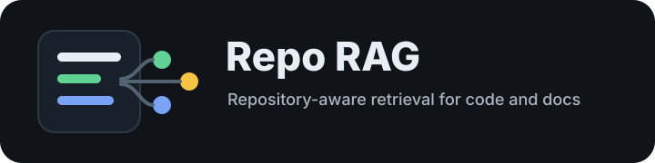

# Repo RAG

<p align="center">
  
</p>

Repo RAG is a Phase 1 retrieval-augmented generation MVP for GitHub repositories.

It can:

- Clone a GitHub repository or load a local repo.
- Discover `.py`, `.md`, and `.txt` files.
- Parse Python with `ast`.
- Split Markdown by headings.
- Create chunk objects with file, symbol, line, language, repo, and commit metadata.
- Generate embeddings through a pluggable interface.
- Store embeddings, content, and metadata in Chroma or a local JSON vector store.
- Retrieve top-k chunks for a user question with hybrid vector + keyword search.
- Build an LLM-ready prompt from retrieved repository context.

## Setup

```bash
python3 -m venv .venv
source .venv/bin/activate
pip install -r requirements.txt
```

## Index A Repository

Using Chroma:

```bash
python3 -m app.cli --store chroma index --repo https://github.com/pallets/flask
```

Using the offline JSON store:

```bash
python3 -m app.cli --store simple --index-name flask index --repo /path/to/local/repo
```

## Query Indexed Chunks

```bash
python3 -m app.cli --store simple --index-name flask query \
  --question "How is routing implemented?" \
  --top-k 5
```

Print an LLM-ready prompt instead of raw matches:

```bash
python3 -m app.cli --store simple --index-name flask query \
  --question "How is routing implemented?" \
  --prompt
```

## End-To-End Ask

`ask` indexes the repo, retrieves relevant chunks, and prints the prompt to send to an LLM.

```bash
python3 -m app.cli --store simple --index-name sample ask \
  --repo work/sample_repo \
  --question "How does login work?" \
  --top-k 3
```

## Optional API

```bash
uvicorn app.api:app --reload
```

Endpoints:

- `POST /index`
- `POST /query`

## Notes

The default embedding provider is deterministic and local. It is useful for development and tests because it requires no API keys or network access. For production-quality retrieval, add a provider backed by a real embedding model while keeping the same `EmbeddingProvider` interface.

## Credits

<p align="center">
  
  &nbsp;&nbsp;
  
</p>

Built with help from Codex and DeepSeek.
